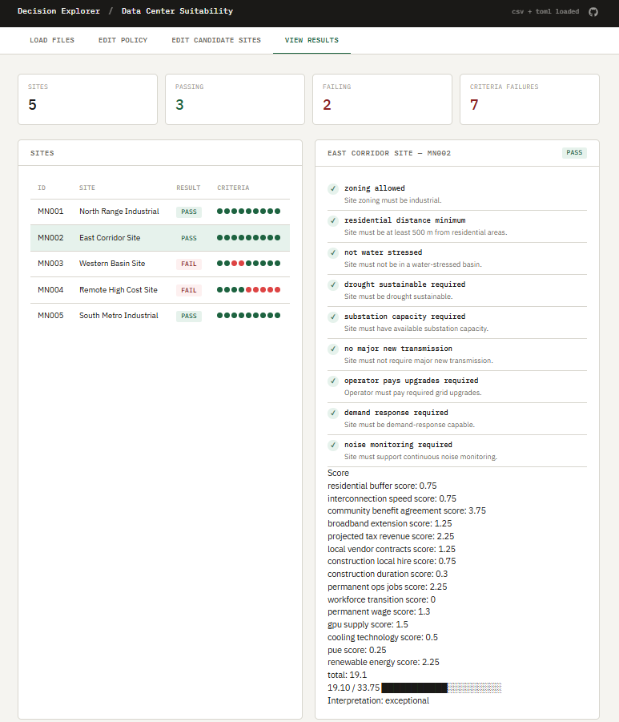
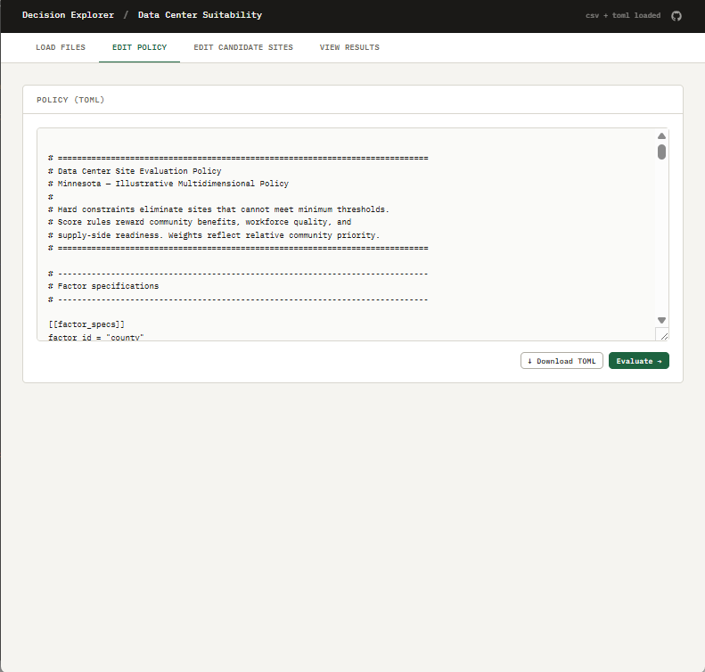
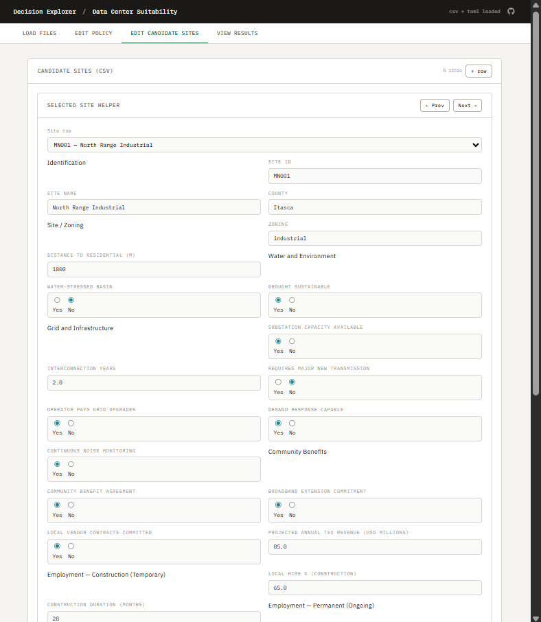

# Decision Explorer: Data Centers

[](https://civic-interconnect.github.io/decision_explorer_data_centers/explorer/)
[](https://civic-interconnect.github.io/decision_explorer_data_centers/)
[](https://github.com/civic-interconnect/decision_explorer_data_centers/actions/workflows/ci-python-zensical.yml)
[](https://github.com/civic-interconnect/decision_explorer_data_centers/actions/workflows/links.yml)
[](#)
[](./LICENSE)

> Putting Data Centers in Context: Promise, Burden, and the Case for Sound Governance

**[Try the Interactive Explorer](https://civic-interconnect.github.io/decision_explorer_data_centers/explorer/)**
To accept the example data and see the results, click the green "Evaluate" button in the lower right-hand corner of either:

- The Example Policies data (TOML)
- The Example Sites data (CSV)







## This Project

This project provides a structured framework for exploring data center siting
and governance tradeoffs under explicit assumptions and constraints.
It:

- frames the issue as one of infrastructure governance
- recognizes the distribution of costs vs benefits
- emphasizes integration with broader systems rather than isolated analysis

The goal is to make tradeoffs visible and inspectable across multiple dimensions.

## Contribution

The contribution of this project is the framework for structured exploration,
not the specific values used in any given evaluation.

- Constraints, thresholds, and weights are configurable
- Assumptions are explicit and inspectable
- Results are comparative and assumption-dependent

This project does not determine outcomes or recommend decisions.
It provides a way to examine how different assumptions and constraints shape outcomes.

## Working Files

Working files are found in these areas:

- **data/** - source inputs and scenario configuration
- **docs/** - narrative, assumptions, and analysis
- **src/** - implementation

## Current Capabilities

- Loads candidate sites from CSV and policy constraints from TOML
- Evaluates hard-constraint admissibility for each site (PASS / FAIL)
- Exports results as JSON for the web Explorer
- Interactive web Explorer for non-technical users

## Potential Benefits

### Tax revenue

Tax revenue is potentially significant and is set during negotiations.
In West Des Moines, Iowa, Microsoft's data centers are projected
to generate over $2 billion in tax revenues over the agreement period ([Brookings](https://www.brookings.edu/articles/why-community-benefit-agreements-are-necessary-for-data-centers/)).
Loudoun County, Virginia (the largest data center market in the world)
now receives an estimated $890 million annually in data center tax revenue,
nearly matching its entire operating budget, and has lowered its
residential real estate tax rate incrementally as a result.¹

### Grid investment

Data center demand can accelerate grid upgrades that benefit all ratepayers,
not just the facility ([Brookings](https://www.brookings.edu/articles/why-community-benefit-agreements-are-necessary-for-data-centers/)).

### Broadband

Some operators have built regional fiber networks as part of development agreements,
enabling businesses, students, and telemedicine across rural areas
that would otherwise lack connectivity ([Brookings](https://www.brookings.edu/articles/turning-the-data-center-boom-into-long-term-local-prosperity/)).

### University and workforce partnerships

Microsoft partnered with Gateway Technical College in Wisconsin to
launch a Datacenter Academy training more than 1,000 students in five years,
and partnered with the University of Wisconsin-Madison on
AI-driven research ([Brookings](https://www.brookings.edu/articles/turning-the-data-center-boom-into-long-term-local-prosperity/)).

¹ Loudoun County figures: [Cardinal News](https://cardinalnews.org/2025/04/10/data-centers-can-bring-high-paying-jobs-and-millions-in-tax-revenue-is-that-what-southside-will-get/)

## Potential Burdens

The Memphis case presented here can be documented at greater length
as it is the most fully reported U.S. case study currently available.

### Air quality concerns in local communities

The xAI Colossus facility in South Memphis began operations in summer 2024,
powered by portable natural gas turbines installed without air permits.
Researchers at the University of Tennessee, Knoxville, analyzing satellite
data from NASA and ESA, found that peak nitrogen dioxide concentrations
in areas immediately surrounding the facility increased by 79% compared
to pre-facility levels.
Ozone readings in the Memphis metropolitan area have exceeded federal limits
for at least two years, and the SELC petitioned the EPA to formally
recognize the area's failure to meet national air quality standards.
The American Lung Association gave both Shelby County, TN, and
DeSoto County, MS an "F" for ozone pollution.

Sources:
- [TIME Investigation](https://time.com/7308925/elon-musk-memphis-ai-data-center/),
- [Tennessee Lookout](https://tennesseelookout.com/briefs/naacp-others-appeal-xai-turbine-permits-for-memphis-data-center/),
- [NAACP](https://naacp.org/articles/naacp-selc-earthjustice-threaten-lawsuit-over-xais-unpermitted-gas-turbines-mississippi)

_Note on contested evidence_:
Researchers at the University of Memphis,
using air dispersion modeling and an independent two-day monitoring campaign,
concluded that xAI's turbines had not measurably degraded ambient air quality,
though they noted the increases would compound an already above-limit baseline
for fine particulate matter.
The two analyses used different methods and measurement periods;
both are cited here ([The Conversation](https://theconversation.com/air-quality-analysis-reveals-minimal-changes-after-xai-data-center-opens-in-pollution-burdened-memphis-neighborhood-265152)).

### Permitting disputes and regulatory process concerns

In 2024, state officials allowed xAI to operate turbines without a permit
by classifying them as "temporary" and "mobile,"
with no required tracking of toxic releases.
After the NAACP and SELC issued a formal notice of intent to sue,
xAI removed 20 turbines from the Colossus 1 site and obtained permits
for the remaining 15.
The company then repeated the same approach at Colossus 2,
despite public opposition, with xAI publicly stating it planned
to "copy and paste" the same strategy.
As of April 2026, the NAACP, represented by SELC and Earthjustice,
has filed a federal Clean Air Act lawsuit.

Sources:

- [SELC](https://www.selc.org/news/xai-built-an-illegal-power-plant-to-power-its-data-center/),
- [NAACP](https://naacp.org/articles/naacp-sues-xai-illegal-pollution-data-center-power-plant)

### Environmental justice and disproportionate siting

The Colossus facility borders Boxtown, a community that is 90% Black with a median income
of approximately $36,000.
Shelby County already led Tennessee in asthma hospitalizations prior to the facility opening.
Boxtown was annexed from the City of Memphis in the 1960s as part of an "urban renewal" program
and has since become home to multiple industrial facilities, including a coal oil refinery,
chemical plants, and large-scale food processing operations.
Community members testified at public hearings, with one resident stating through tears:

_"I can't breathe at home, it smells like gas outside."_

Sources:

- [NewsOne / Politico](https://newsone.com/6856289/naacp-sued-xai-elon-musk-memphis-data-centers/),
- [NCRC](https://ncrc.org/south-memphis-residents-skeptical-of-musks-xai-economic-growth-claims-as-pollution-concerns-grow/),
- [Memphis Flyer](https://www.memphisflyer.com/a-peoples-history-of-the-fight-against-xai/)

### Groundwater pressure on a shared drinking water supply

Colossus cooling systems are projected to eventually draw
upward of 5 million gallons per day from the Memphis Sand Aquifer,
a regional drinking water source.
The aquifer is overlain by unlined coal ash ponds containing arsenic,
raising concerns among community groups that increased pumping could
draw contaminated water downward into the drinking water supply.
The nonprofit Protect Our Aquifer notes that more water is currently
being withdrawn from the Memphis Sand Aquifer than is
being naturally replenished.
xAI has committed to an $80M water recycling facility using
treated wastewater by end of 2026,
but community advocates have raised concerns about oversight
given the company's regulatory track record.

Sources:

- [Energy & Infrastructure Policy](https://news.oilandgaswatch.org/post/natural-gas-power-grab-for-musk-ai-data-center-in-memphis-sparks-environmental-justice-fight),
- [SEHN](https://www.sehn.org/sehn/2025/8/14/data-centers-and-the-water-crisis),
- [Protect Our Aquifer](https://www.protectouraquifer.org/issues/xai-supercomputer),
- [Governing](https://www.governing.com/resilience/wastewater-will-cool-this-memphis-data-center)

### Uneven distribution of economic benefits

Memphis estimates receiving $13 million in tax revenue from xAI in its first year,
with only $3 million allocated to zip codes within a five-mile radius of the facility:
the area bearing the direct environmental costs.
State Representative Justin Pearson, who represents South Memphis,
has stated publicly that the billions in company valuation do not translate
to comparable local investment ([NCRC](https://ncrc.org/south-memphis-residents-skeptical-of-musks-xai-economic-growth-claims-as-pollution-concerns-grow/)).

## Resources

### Energy demand - global and U.S.

- International Energy Agency (IEA) Energy and AI (April 2025): <https://www.iea.org/reports/energy-and-ai/energy-demand-from-ai>
  - Global: ~415 TWh in 2024 (1.5% of global electricity); projected to double to ~945 TWh by 2030 (~3%)
  - U.S.: ~45% of global total in 2024; ~4% of all U.S. electricity
  - Nearly half of U.S. capacity concentrated in five regional clusters (Northern Virginia, Dallas, Silicon Valley, Phoenix, Chicago area)
  - U.S. data centers projected to consume more electricity by 2030 than all energy-intensive manufacturing combined
  - AI is primary driver; accelerated servers growing ~30% annually
- U.S. Energy Information Administration (EIA): <https://www.eia.gov/>
- U.S. Department of Energy (DOE): <https://www.energy.gov/>

### Data center energy and infrastructure

- Lawrence Berkeley National Laboratory: <https://datacenters.lbl.gov/>
- Electric Power Research Institute (EPRI): <https://www.epri.com/>

### Water and environmental context

- U.S. Geological Survey (USGS): <https://www.usgs.gov/>
- USGS Water Use in the United States: <https://www.usgs.gov/mission-areas/water-resources/science/water-use-united-states>
- World Resources Institute (WRI): <https://www.wri.org/>
- National Ground Water Association (NGWA): <https://www.ngwa.org> - publishes research on data center groundwater demand and aquifer impacts

### Policy and governance

- National Conference of State Legislatures (NCSL): <https://www.ncsl.org/>
- Federal Energy Regulatory Commission (FERC): <https://www.ferc.gov/>
- EPA Environmental Justice Screening Tool (EJScreen): <https://www.epa.gov/ejscreen> - standard reference for documenting baseline community burden before siting decisions
- EPA AirNow: <https://www.airnow.gov> - real-time and historical air quality index data by location

### Research and analysis

- Resources for the Future (RFF): <https://www.rff.org> - economics research on energy, environment, and infrastructure tradeoffs
- Bipartisan Policy Center: <https://bipartisanpolicy.org> - energy and infrastructure policy analysis
- BloombergNEF: <https://about.bnef.com> - data center energy demand forecasting from investment research perspective
- National Academies of Sciences, Engineering, and Medicine: <https://www.nationalacademies.org> - consensus scientific reports on energy infrastructure and environmental impacts
-
### Industry practices and metrics

- Uptime Institute: <https://uptimeinstitute.com/>
- Green Grid: <https://www.thegreengrid.org/>

## Command Reference

<details>
<summary>Show command reference</summary>

### In a machine terminal (open in your `Repos` folder)

After you get a copy of this repo in your own GitHub account,
open a machine terminal in your `Repos` folder:

```shell
# Replace username with YOUR GitHub username.
git clone <https://github.com/username/decision_explorer_data_centers

cd decision_explorer_data_centers
code .
```

### In a VS Code terminal

```shell
# Set Up the Environment
uv self update
uv python pin 3.14
uv sync --extra dev --extra docs --upgrade
uvx pre-commit install

# Local format + lint
uv run ruff format --check .
uv run ruff check .

# Pre-commit (enforce repo rules)
git add -A
uvx pre-commit run --all-files
# repeat if changes were made
git add -A
uvx pre-commit run --all-files

# Static + security + dependency checks
uv run validate-pyproject pyproject.toml
uv run deptry .
uv run bandit -c pyproject.toml -r src

# Tests (after static checks pass)
uv run pytest --cov=src --cov-report=term-missing

uv run python -m decision_explorer_data_centers.cli --candidates data/raw/example_candidates.csv --policy data/raw/example_policy.toml --output-json docs/data/results.json

# Docs build (after everything passes)
uv run zensical build

# Commit and push
git add -A
git commit -m "update"
git push -u origin main
```

</details>
